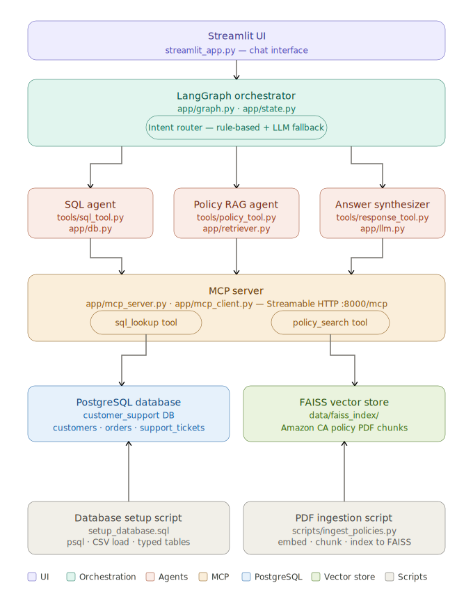

# Customer Support Multi-Agent System

A Generative AI–powered system designed to assist customer support executives in efficiently accessing and understanding information across multiple data sources. It enables natural language interaction with both structured customer data (such as profiles and support tickets) and unstructured content like policy documents. By combining these capabilities, the system delivers accurate, context-aware responses, improving productivity and enhancing the overall quality of customer support.


Note: The dataset used in this project includes customer, order, and support ticket data sourced from [Kaggle](https://www.kaggle.com/datasets/vinaykandimalla/customer-360?resource=download) for the SQL database. The unstructured data consists of [Amazon return policy](https://www.amazon.ca/gp/help/customer/display.html?nodeId=GKM69DUUYKQWKWX7), [privacy policy](https://www.amazon.ca/gp/help/customer/display.html?nodeId=GX7NJQ4ZB8MHFRNJ), and [terms & conditions](https://www.amazon.ca/gp/help/customer/display.html?nodeId=GLSBYFE9MGKKQXXM) documents in PDF format.
---

## 1. Objective

In this solution, the support executive can:

- ask policy questions such as **"What is the current refund policy?"**
- ask structured-data questions such as **"Give me a quick overview of customer Rachel Moore's profile and past support ticket details."**
- ask hybrid questions such as **"Does Michael's latest complaint qualify for refund under the current refund policy?"**

---

## 2. Project Overview:

1. User enters a question in Streamlit.
2. `SupportMultiAgent` runs a LangGraph workflow.
3. The system routes the user query into one of these paths:

  - **Structured path** → fetches customer, ticket, and order data from SQL
  - **Document path** → retrieves relevant policy chunks from the vector store
  - **Hybrid path** → combines SQL evidence and policy evidence, then produces a grounded answer
  - **Clarification path** → asks the user to clarify ambiguous requests

4. The graph calls MCP tools:
   - `sql_lookup`
   - `policy_search`
5. The final response is synthesized by the LLM using only the returned SQL and/or policy context.

---

## 3. Architecture


## 4. Tech stack

### Core frameworks
- LangChain
- LangGraph
- MCP Python SDK

### Models
- OpenAI chat model (default: `gpt-4o-mini`)
- OpenAI embeddings (default: `text-embedding-3-small`)

### Databases / storage
- PostgreSQL for structured customer data
- FAISS for vector retrieval over policy PDFs

### UI
- Streamlit

---

## 5. Setup instructions

### Prerequisites

Install the following first:

- Python 3.10+
- PostgreSQL
- `pip`
- OpenAI API key

### Step 1: Create a virtual environment

#### Windows
```bash
python -m venv .venv
.venv\Scripts\activate
```

#### macOS / Linux
```bash
python -m venv .venv
source .venv/bin/activate
```

### Step 2: Install dependencies

```bash
pip install -r requirements.txt
```

### Step 3: Set credentials in `.env`

- Copy .env.example as .env
- Replace with your credentials

---

## 6. Load the structured data into PostgreSQL

### Run the SQL setup script

In your terminal, excute the following:

```bash
set BASE= <path_to_customer_dataset(in data)_folder>

psql -U postgres -f setup_database.sql -v customers_path="%BASE%\customers.csv" -v orders_path="%BASE%\orders.csv"  -v tickets_path="%BASE%\support_tickets.csv"
```

**Note**: On Windows, use forward slashes in the file paths.

---

## 7. Ingest policy PDFs into FAISS

Place policy PDFs inside:

```text
data/policies/
```

Then run:

```bash
python -m scripts.ingest_policies
```
---

## 8. Run the tests

Run the following command:

```bash
pytest -q tests
```

**Note:**

- The tests use mocks and stubs so they do not call real OpenAI, PostgreSQL, FAISS, MCP, or Streamlit services.
- This keeps the suite fast, deterministic, and suitable for local development as well as CI.


## 9. Run the MCP server

The current implementation uses **streamable HTTP transport**, so start the MCP server first:

```bash
python -m app.mcp_server
```

The client expects the server at:

```text
http://127.0.0.1:8000/mcp
```

---

## 10. Run the Streamlit application

In a second terminal, run:

```bash
streamlit run streamlit_app.py
```

Then open the local Streamlit URL shown in the terminal.

---

## 11. Sample queries

#### Policy-only
- What is the current refund policy?
- What does the cancellation policy say?

#### Structured-data only
- Give me a quick overview of customer Rachel Moore's profile and past support ticket details.
- What did Stephen Smith buy recently?

#### Hybrid
- Does Michael still return his last order under the current refund policy?
- Based on Shannon's latest ticket, what policy rule applies?

#### Clarify
- Talk to customer care
